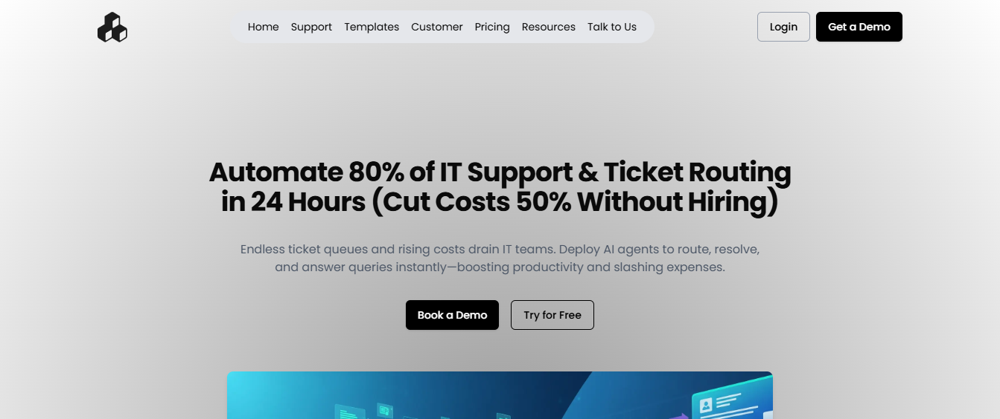

# StackAI Landing Page Redesign

A complete redesign of the [StackAI](https://www.stack-ai.com/) landing page focused on increasing **demo bookings** through improved UI/UX.  
The project features a **scalable**, **efficient**, and **easily integratable** frontend built with **Next.js**, **TypeScript**, and **Tailwind CSS**, designed to seamlessly connect with any backend.

## Live Demo / Preview
🔗 **Live Demo:** [View Website](https://stack-ai-zeta.vercel.app/)

## Screenshots


## Table of Contents
1. [About the Project](#about-the-project)
2. [Features](#features)
3. [Tech Stack](#tech-stack)
4. [Getting Started](#getting-started)
5. [Usage](#usage)
6. [Contributing](#contributing)
7. [License](#license)
8. [Contact](#contact)

---

## About the Project

This project is a **UI/UX redesign** of StackAI’s main landing page.  
The primary goal was to **increase demo booking conversions** by enhancing visual hierarchy, improving the call-to-action design, and ensuring the frontend code is **highly maintainable and integration-ready** for any backend API.

Key focus areas:
- Optimized **demo booking funnel** design
- Better mobile & desktop responsiveness
- Accessible and scalable frontend codebase

---

## Features

- 🎯 Improved call-to-action flow to maximize conversions
- 📱 Fully responsive design for all screen sizes
- ⚡ Built with Next.js for fast load times and SEO optimization
- 🎨 Styled using Tailwind CSS for rapid UI development
- 🔌 Easily integratable with any backend API
- 🧩 Component-based architecture for scalability

---

## Tech Stack

- **Next.js** – React-based framework for SSR and routing
- **TypeScript** – Static typing for maintainable code
- **Tailwind CSS** – Utility-first CSS for styling
- **Vercel** – Deployment and hosting

---

## Getting Started

Follow these steps to run the project locally.

### Prerequisites
- Node.js 18+
- npm or yarn

## Installation

1. **Clone the repository**

   ```bash
   git clone https://github.com/KofiAnaan0/stack_ai.git

2. **Navigate into the project directory**

   ```bash
   cd stack_ai

3. **Install dependencies**

   ```bash
   npm install

4. **Start the development server**

   ```bash
   npm run dev

5. **Open the app in your browserVisit http://localhost:3000 to view the website**

## Author
**Isadru Santos** – [Portfolio](https://github.com/KofiAnaan0) | [LinkedIn](https://linkedin.com/in/isadru-santos/)
